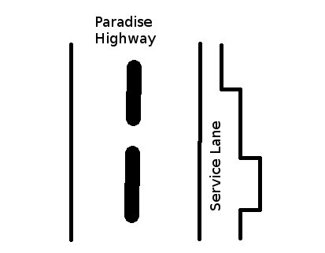

Service Lane
===================

###Problem Statement###

Calvin is driving his favorite vehicle on the 101 freeway. He notices that the check engine light of his vehicle is on, and he wants to service it immediately to avoid any risks. Luckily, a service lane runs parallel to the highway. The length of the highway and the service lane is N units. The service lane consists of N segments of equal length and different width.

Calvin can enter to and exit from any segment. Let's call the entry segment as index i and the exit segment as index j. Assume that the exit segment lies after the entry segment (i≤j) and 0≤i. Calvin has to pass through all segments from index i to index j (both inclusive).



Calvin has three types of vehicles - bike, car, and truck - represented by 1, 2 and 3, respectively. These numbers also denote the width of the vehicle.

You are given an array width of length N, where width[k] represents the width of the kth segment of the service lane. It is guaranteed that while servicing he can pass through at most 1000 segments, including the entry and exit segments.

If width[k]=1, only the bike can pass through the kth segment.
If width[k]=2, the bike and the car can pass through the kth segment.
If width[k]=3, all three vehicles can pass through the kth segment.
Given the entry and exit point of Calvin's vehicle in the service lane, output the type of the largest vehicle which can pass through the service lane (including the entry and exit segments).

###Input Format###

The first line of input contains two integers, N and T, where N denotes the length of the freeway and T the number of test cases. The next line has N space-separated integers which represent the width array.

T test cases follow. Each test case contains two integers, i and j, where i is the index of the segment through which Calvin enters the service lane and j is the index of the lane segment through which he exits.

###Constraints###

```
2 ≤ N ≤ 100000 
1 ≤ T ≤ 1000 
0 ≤ i < j < N
2 ≤ j−i+1 ≤ min(N,1000) 
1 ≤ width[k] ≤ 3,where 0≤k<N
```

###Output Format###

For each test case, print the number that represents the largest vehicle type that can pass through the service lane.

*Note:* Calvin has to pass through all segments from index i to index j (both inclusive).

###Sample Input###

```
8 5
2 3 1 2 3 2 3 3
0 3
4 6
6 7
3 5
0 7
```

###Sample Output###

```
1
2
3
2
1
```

###Explanation###

Below is the representation of the lane:

```
   |Lane|    ->    Width

0: |--|            2  
1: |---|           3  
2: |-|             1  
3: |--|            2  
4: |---|           3  
5: |--|            2  
6: |---|           3  
7: |---|           3  
```

1. (0, 3): Because width[2] = 1, only the bike can pass through it.
2. (4, 6): Here the largest allowed vehicle which can pass through the 5th segment is the car and for the 4th and 6th segment it's the truck. Hence the largest vehicle allowed in these segments is a car.
3. (6, 7): In this example, the vehicle enters at the 6th segment and exits at the 7th segment. Both segments allow even trucks to pass through them. Hence the answer is 3.
4. (3, 5): width[3] = width[5] = 2. While the 4th segment allows the truck, the 3rd and 5th allow up to a car. So 2 will be the answer here.
5. (0, 7): The bike is the only vehicle which can pass through the 2nd segment, which limits the strength of the whole lane to 1.