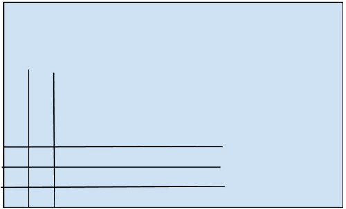

Halloween Party
===================

###Problem Statement###

Alex is attending a Halloween party with his girlfriend, Silvia. At the party, Silvia spots the corner of an infinite chocolate bar (two dimensional, infinitely long in width and length).

If the chocolate can be served as only 1 x 1 sized pieces and Alex can cut the chocolate bar exactly K times, what is the maximum number of chocolate pieces Alex can cut and give Silvia?

###Input Format###

The first line contains an integer T, the number of test cases. T lines follow.
Each line contains an integer K.

###Output Format###

T lines; each line should contain an integer that denotes the maximum number of pieces that can be obtained for each test case.

###Constraints###

<pre>
1 ≤ T ≤ 10
2 ≤ K ≤ 10<sup>7</sup> 
</pre>

**Note:** Chocolate must be served in 1 x 1 sized pieces. Alex can't relocate any of the pieces, nor can he place any piece on top of another.

###Sample Input###

```
4
5
6
7
8
```

###Sample Output###

```
6
9
12
16
```

###Explanation###

The explanation below is for the first two test cases. The rest of them follow a similar logic.

For the first test-case where K=5, you need 3 horizontal and 2 vertical cuts.



For the second test case, where K=6, you need 3 horizontal and 3 vertical cuts.